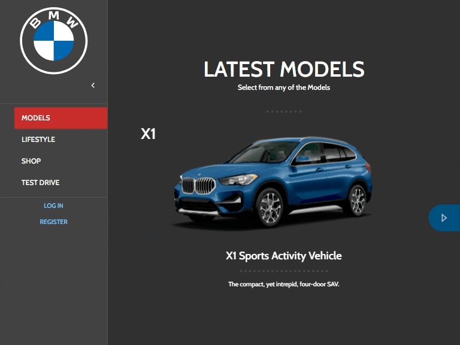
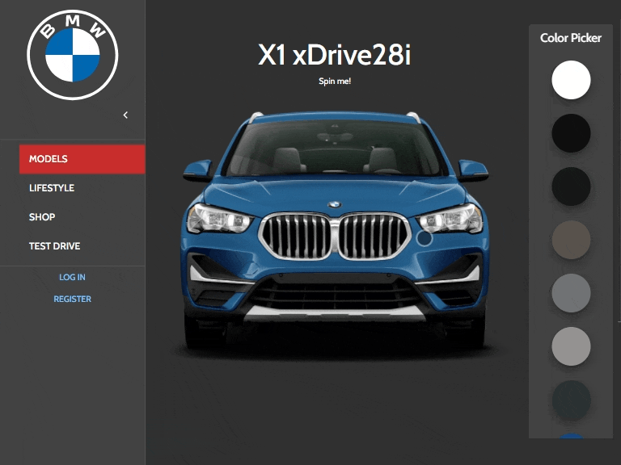

# BMW Test-Drive

> React/Redux Project where I developed a website and an API to set up Appointments to test-drive a car. The app depends on https://github.com/Bismarck-GM/BMW-test-drive-backend/ API to work. 
## Features:

### The website works both in Table-sized and Desktop-sized displays. There's no current Mobile version for it.

Main Pages - Login In - Setting an Appointment          |
:-------------------------:                             |
                          |

Models Page - Color Switch         |
:-------------------------:        |
  |

360° Showcase                      |
:-------------------------:        |
  |


## Live Demo:

#### [BMW Test-Drive - REACT - deployed in GitHubPages - Click Here](https://bismarck-gm.github.io/BMW-test-drive/)

## Built With

- JavaScript (ES6)
- React.JS
- Redux
- Thunk
- Axios
- React-router
- Node.js
- prop-types
- Material-UI
- DateFNS
- SwiperJS
- TRIDI
- Jest
- React Testing Library

## Getting Started

### Prerequisites

- Node.js
- Any Browser

To get started open the directory where you will save this repo by typing on your terminal:

```
$ cd <directory>
```

- Clone the repo typing:

```
$ git clone git@github.com:Bismarck-GM/BMW-test-drive.git
```

- Install dependencies:

After cloning move into the recently created folder (BMW-test-drive) and run

```
$ npm install
```

### Usage

Start the React server:

```
$ npm start
```

A new browser tab/window will open up after the server is initiated.

Redux Toolkit is running. You can check the Actions by using Redux DevTools in Chrome/Firefox.
### Testing

To run the test simply run:

```
$ npm run test
```
## Author

👤 **Gerónimo Morisot**

- Github: [@Bismarck-GM](https://github.com/Bismarck-GM)
- Twitter: [@Rewritablee](https://twitter.com/Rewritablee)
- LinkedIn: [Geronimo Morisot](https://linkedin.com/in/geronimomorisot)

## 🤝 Contributing

Contributions, issues and feature requests are welcome!

## Show your support

Give a ⭐️ if you like this project!
Feel free to check the [issues page](issues/).

## 📝 License

This project is [MIT](lic.url) licensed.